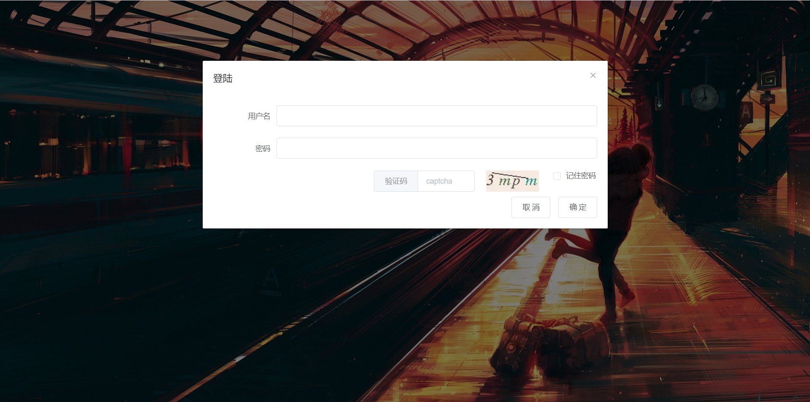
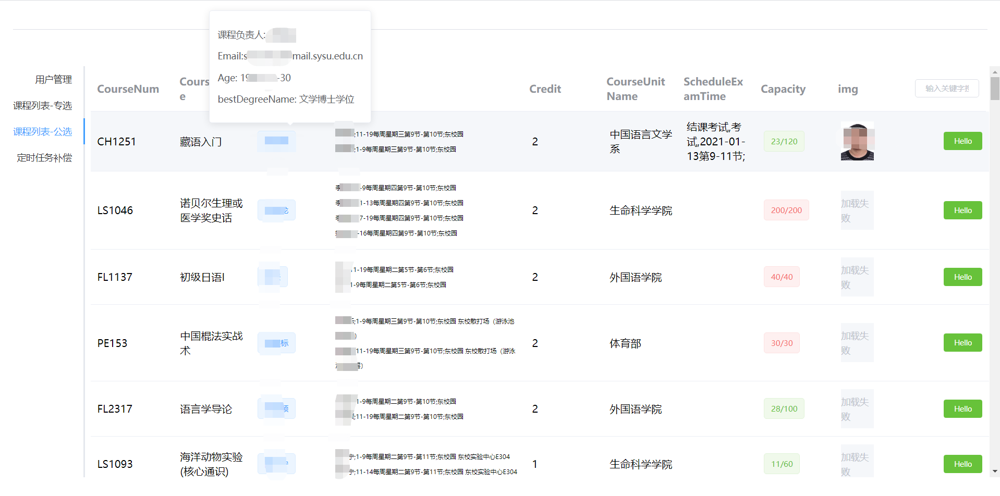
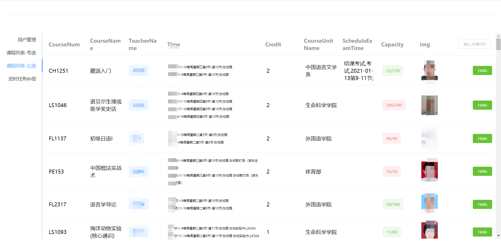
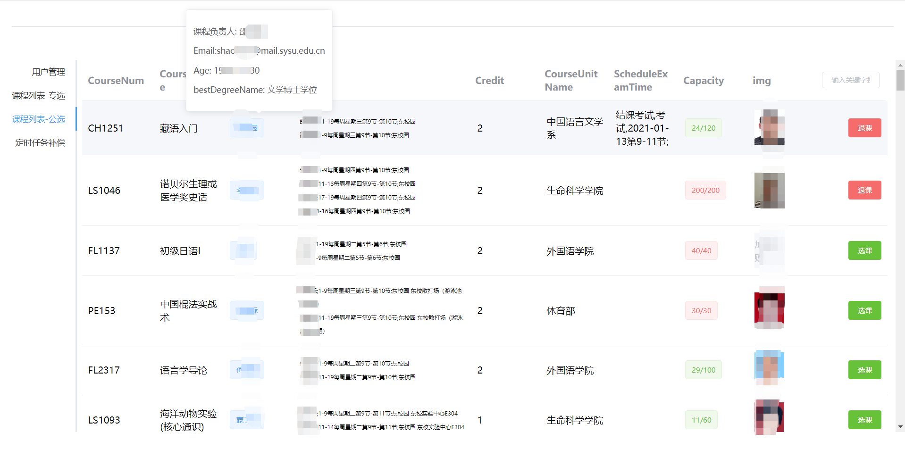

# sysu_jwxt_v2
# 
---
- 当前版本
  - 适配 jwxt.sysu.edu.cn/jwxt
  - 课程仅查询东校园,仅支持专选和公选
---
## 页面展示
- 登陆
  - 
- 课程列表
  - 

  - 

  - 
---
## TODO:
- [x] 选课
- [x] 退课
---
## BUG:
- 
---
## 运行:
1. 下载本仓库,或git clone  
2. 直接鼠标双击打开 `main.exe` (最好使用shell:`./main`)
3. 打开网页: `localhost:9999`
---
## 编译
> 不清楚会不会遇到一些动态链接出错的问题,可能会缺少运行库,建议自己编译
- 下载安装 `golang `
- `go get` 按照第三方包
  - gin : `go get github.com/gin-gonic/gin`
  - goquery : `github.com/PuerkitoBio/goquery`
- `go build` (在当前文件目录下)
- `./main`

---
### ChangeLog:
- 2020/8/15  repo created
  - 基本界面设计
  - 爬取课程列表
  - 爬取教师信息
- 2020/8/15 教师信息加载: `mounted() -> row @hover` 
- 2020/8/15 更新选课/退课前端后端接口
- 2020/8/16 完成选课/退课,课程信息加载: `mounted -> @tab-click`
- 2020/8/16 修改选课/退课后端接口,修改前端登陆页面,后端添加了课程加入收藏动作
- 2020/8/18 前端添加了定时任务(自动选课)界面
- 2020/8/24 初步完成了定时任务(抢课),目前由于未交学费,接口无法测试
- 2020/9/2 删除了抢课接口,仅保留选课退课,以及对老师信息如邮箱照片的展示